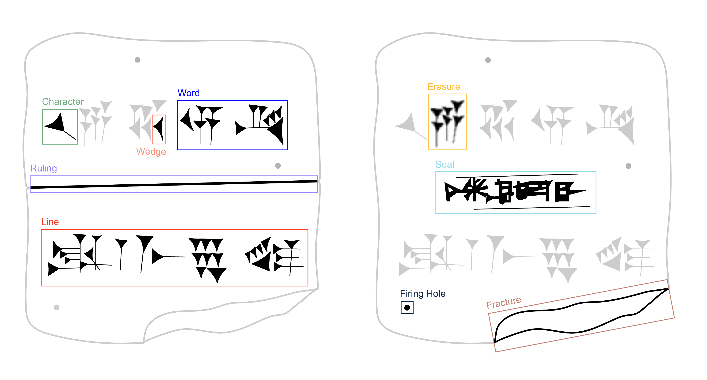

# Cuneiform Ontology

This repository includes a set of ontologies which enable cuneiform artifact related data to be interconnected.

The goal of this collection of ontologies is to connect:
* Linked Data Dictionaries defined by the (https://www.w3.org/2019/09/lexicog/)[Ontolex-Lemon model] 
* Cuneiform 3D meshes
* 3D renderings
* Photos
* Part of Speech Tagging Vocabularies 
* Annotations on the aforementioned media

## Annotation vocabularies
Annotation vocabularies used in this repository are suited for the need of annotations being made on depictions of sides of cuneiform tablets.

The previous picture shows possible areas of annotation on a cuneiform tablet. These areas among others are covered by the annotation vocabulary which is present in this repository and might be used in any annotation program using for example the (https://www.w3.org/TR/annotation-model/)[W3C Web Annotation Data Model] for annotation.

## Part Of Speech Tagging Vocabularies
This repository includes vocabularies for annotating Part Of Speech Tags derived from the (https://github.com/acoli-repo/olia)[OLiA model].
The following languages may be annotated with the vocabularies provided:
* Akkadian
* Hittite
The vocabularies include a specific Part Of Speech Tagging set by the (https://www.hethport.uni-wuerzburg.de/HPM/index.php)[Hethitology portal Mainz], refined by experts of the University of Mainz.
The definition of different part of speech tagging sets is possible.

## Conversion scripts
To enable an interconnectivity of different data repositories with the given ontology model, conversion scripts for data dumps of the following repositories are provided in this repository:
* Cuneiform Digital Library Initiative (CDLI): This conversion script parses the metadata dump of the cuneiform digital library initiative to create a linked data representation of cuneiform artifacts. As CDLI only provides artifact metadata and transliterations of some artifacts, the script could at the maximum be extended to also represent transliteration representations in linked data
* ORACC: This conversion script converts corpora of ORACC as shown in https://github.com/oracc/json to the RDF represntation of this repository. In particular, the script is adapted to parse individual .json files of the respective corpus of ORACC. Future work may extend this script to also include annotations such as places, temples, people and divine beings provided in ORACC corpora
